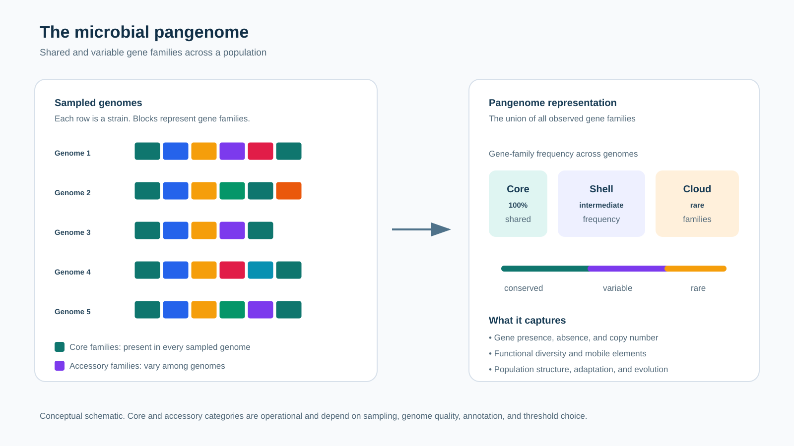

# Awesome Microbial Pangenomics

A carefully curated, research-oriented collection of software, databases, benchmarks, teaching material, and primary literature for **microbial pangenomics**.

This list is built for bacterial and archaeal comparative genomics. It distinguishes gene-cluster pangenomes from sequence and graph pangenomes, and prioritizes tools with accessible source code, documentation, a clear scientific use case, and a citable paper or maintained project page.

> **Start here:** A robust pangenome is not created by selecting a single program. Control genome quality and taxonomy, apply consistent annotation, state clustering and core thresholds, inspect the graph or gene families, then report the software versions and parameters.

*Figure 1. Original conceptual schematic of a microbial pangenome. The pangenome is the union of observed gene families. Core, shell, cloud, and unique families are frequency-based operational categories; unique genes occur in one sampled genome and are generally a cloud subset. Open and closed descriptions summarize whether the gene-accumulation curve continues to grow or approaches saturation under the sampling design. Concept adapted from [Tettelin et al. (2005)](https://doi.org/10.1073/pnas.0506758102), [Medini et al. (2005)](https://doi.org/10.1016/j.gde.2005.09.006), [Tettelin et al. (2008)](https://doi.org/10.1016/j.cub.2008.01.071), and [Matthews et al. (2024)](https://doi.org/10.1093/bib/bbae588).* 

## Contents

- [Concepts and standards](#concepts-and-standards)
- [Before the pangenome](#before-the-pangenome)
- [Gene-cluster pangenome construction](#gene-cluster-pangenome-construction)
- [Sequence and graph pangenomes](#sequence-and-graph-pangenomes)
- [Downstream analysis](#downstream-analysis)
- [Visualization and exploration](#visualization-and-exploration)
- [Databases and reference resources](#databases-and-reference-resources)
- [Workflows and reproducibility](#workflows-and-reproducibility)
- [Benchmarks and essential reading](#benchmarks-and-essential-reading)
- [Learning resources](#learning-resources)
- [Contributing](#contributing)

## Concepts and standards

- [Tettelin et al. (2005)](https://doi.org/10.1073/pnas.0506758102) introduced the microbial pan-genome in *Streptococcus agalactiae*.
- **Core, soft core, shell, cloud, and singleton** are operational categories. Their boundaries depend on sampling, assembly/annotation quality, clustering method, and the stated frequency threshold.
- A **gene-cluster pangenome** summarizes homologous gene families and their presence, absence, copy number, and neighborhood. A **sequence/graph pangenome** additionally represents nucleotide-level alleles and structural alternatives.
- Use [ANI](https://doi.org/10.1038/s41467-018-07641-9), quality metrics, and taxonomy to define a coherent comparison set. A pangenome spanning deep taxonomic diversity is possible, but should not be interpreted with species-level core thresholds.
- See the [curated reading list](docs/reading-list.md) for definitions, reporting guidance, and primary sources.

## Before the pangenome

### Genome acquisition, taxonomy, and quality control

| Resource | Use |
|---|---|
| [NCBI Datasets](https://www.ncbi.nlm.nih.gov/datasets/docs/v2/) | Programmatic access to RefSeq and GenBank assemblies and metadata |
| [ENA](https://www.ebi.ac.uk/ena/browser/home) | International nucleotide sequence archive and raw-read access |
| [GTDB-Tk](https://github.com/Ecogenomics/GTDBTk) | Genome taxonomy using the Genome Taxonomy Database |
| [FastANI](https://github.com/ParBLiSS/FastANI) | Fast average nucleotide identity estimation |
| [skani](https://github.com/bluenote-1577/skani) | Fast ANI and all-versus-all genome comparison |
| [CheckM2](https://github.com/chklovski/CheckM2) | Machine-learning genome completeness and contamination estimates |
| [GUNC](https://gitlab.com/uneven-cake/gunc) | Detection of chimerism and contamination in prokaryotic genomes |
| [QUAST](https://github.com/ablab/quast) | Assembly-contiguity assessment |
| [Mash](https://github.com/marbl/Mash) | MinHash distances for rapid screening and dereplication |
| [dRep](https://github.com/MrOlm/drep) | Genome dereplication and representative selection |

### Consistent annotation

| Tool | Use |
|---|---|
| [Bakta](https://github.com/oschwengers/bakta) | Standardized bacterial genome annotation with database-backed identifiers |
| [Prokka](https://github.com/tseemann/prokka) | Widely used rapid prokaryotic annotation |
| [DFAST](https://github.com/nigyta/dfast_core) | Prokaryotic genome annotation pipeline |
| [eggNOG-mapper](https://github.com/eggnogdb/eggnog-mapper) | Orthology-based functional annotation |
| [AMRFinderPlus](https://github.com/ncbi/amr) | Antimicrobial-resistance and stress-gene identification |

## Gene-cluster pangenome construction

| Tool | Best fit | Notes |
|---|---|---|
| [Roary](https://github.com/sanger-pathogens/Roary) | Fast gene-cluster pangenomes from consistently annotated GFF3 files | Classic workflow; report identity and core thresholds |
| [Panaroo](https://github.com/gtonkinhill/panaroo) | Bacterial pangenomes with graph-based cleaning of annotation and assembly artifacts | Particularly valuable with draft assemblies |
| [PPanGGOLiN](https://github.com/labgem/PPanGGOLiN) | Partitioned pangenome graph and persistent, shell, cloud modeling | Uses gene neighborhoods as well as family occurrence |
| [PIRATE](https://github.com/SionBayliss/PIRATE) | Diverse bacterial populations and multi-threshold clustering | Explicitly resolves sequence-divergence thresholds |
| [PEPPAN](https://github.com/zheminzhou/PEPPAN) | Large, genetically diverse bacterial collections | Includes paralog and annotation-error handling |
| [PanTA](https://github.com/LiaoBioinfo/PanTA) | Incremental analysis of large, growing genome collections | Designed to update without rebuilding the full pangenome |
| [PGAP2](https://github.com/BioinformaticsCSU/PGAP2) | Recent prokaryotic pangenome construction and post-processing | Includes quality-aware correction and graph analysis |
| [PanACoTA](https://github.com/gem-pasteur/PanACoTA) | End-to-end preparation, annotation, core alignment, and phylogeny | Modular workflow for bacterial datasets |
| [panX](https://github.com/neherlab/pan-genome-analysis) | Population-scale pangenome analysis and interactive exploration | Links gene families, gene trees, and metadata |
| [anvi'o](https://github.com/merenlab/anvio) | Integrated comparative genomics and pangenome exploration | Strong support for visualization and multi-omic context |
| [Panakeia](https://github.com/MicrobialProteomics/Panakeia) | Gene-content and graph-structural analysis | Useful for graph topology and gene-context exploration |
| [RIBAP](https://github.com/hoelzer-lab/ribap) | Core-genome annotation across diverse bacteria | Designed for more distant bacterial comparisons |

## Sequence and graph pangenomes

| Tool | Use |
|---|---|
| [PanGraph](https://github.com/neherlab/pangraph) | Scalable bacterial pangenome graphs that retain nucleotide and structural variation |
| [PGGB](https://github.com/pangenome/pggb) | Reference-unbiased whole-genome graph construction from assemblies |
| [minigraph](https://github.com/lh3/minigraph) | Incremental reference pangenome graph construction |
| [Minigraph-Cactus](https://github.com/ComparativeGenomicsToolkit/cactus) | Reference pangenome graph construction for high-quality assemblies |
| [seqwish](https://github.com/ekg/seqwish) | Induction of variation graphs from pairwise alignments |
| [smoothxg](https://github.com/pangenome/smoothxg) | Graph normalization and local multiple alignment |
| [vg](https://github.com/vgteam/vg) | Graph-based read mapping, genotyping, and variant analysis |
| [odgi](https://github.com/pangenome/odgi) | Efficient graph manipulation, sorting, statistics, and layout |
| [gfaffix](https://github.com/marschall-lab/GFAffix) | Identification and collapse of redundant GFA graph structures |
| [pangene](https://github.com/lh3/pangene) | Gene-order, orientation, and copy-number graph analysis |

## Downstream analysis

### Core genome, phylogeny, and recombination

| Tool | Use |
|---|---|
| [MAFFT](https://mafft.cbrc.jp/alignment/software/) | Multiple-sequence alignment |
| [IQ-TREE](https://github.com/iqtree/iqtree2) | Maximum-likelihood phylogenetic inference and model selection |
| [Gubbins](https://github.com/nickjcroucher/gubbins) | Detection and masking of recombinant regions in bacterial alignments |
| [ClonalFrameML](https://github.com/xavierdidelot/ClonalFrameML) | Recombination-aware bacterial phylogenetic inference |
| [PopPUNK](https://github.com/bacpop/PopPUNK) | Population clustering from core and accessory genome distances |

### Association, enrichment, and mobile elements

| Tool | Use |
|---|---|
| [pyseer](https://github.com/mgalardini/pyseer) | Population-structure-aware microbial pangenome and k-mer association testing |
| [Scoary](https://github.com/AdmiralenOla/Scoary) | Pan-GWAS screening using gene presence and absence |
| [Coinfinder](https://github.com/widmi/coinfinder) | Significant gene co-occurrence and dissociation with phylogeny awareness |
| [DefenseFinder](https://github.com/mdmparis/defense-finder) | Detection of antiviral defense systems |
| [PADLOC](https://github.com/padlocbio/padloc) | Detection of antiviral defense systems and mobile-defense islands |
| [MOB-suite](https://github.com/phac-nml/mob-suite) | Plasmid typing, reconstruction, and mobility prediction |
| [geNomad](https://github.com/apcamargo/genomad) | Virus and plasmid identification in genomes and metagenomes |

## Visualization and exploration

| Tool | Use |
|---|---|
| [Phandango](https://jameshadfield.github.io/phandango/) | Phylogeny-aligned exploration of pangenome, recombination, metadata, and GWAS outputs |
| [FriPan](https://github.com/dr-L/FriPan) | Interactive bacterial pangenome browser |
| [panX](https://pangenome.de/) | Web exploration of gene-family histories and distributions |
| [anvi'o](https://anvio.org/) | Interactive pangenomes, genomes, metagenomes, functions, and metadata |
| [Bandage](https://github.com/rrwick/Bandage) | Interactive inspection of local assembly and GFA graph topology |
| [Sequence Tube Map](https://github.com/vgteam/sequenceTubeMap) | Local graph paths, variants, and read support |
| [BandageNG](https://github.com/asl/BandageNG) | Modern, high-performance assembly-graph visualization |
| [ODGI visualizations](https://odgi.readthedocs.io/en/latest/rst/commands/odgi_draw.html) | One- and two-dimensional graph layouts and path-depth summaries |
| [clinker](https://github.com/gamcil/clinker) | Gene-cluster comparison and interactive synteny visualization |
| [Microreact](https://microreact.org/) | Shareable genomic epidemiology visualizations with metadata and maps |

## Databases and reference resources

| Resource | Use |
|---|---|
| [GTDB](https://gtdb.ecogenomic.org/) | Genome-based bacterial and archaeal taxonomy |
| [BV-BRC](https://www.bv-brc.org/) | Integrated bacterial and viral genomics data and tools |
| [BV-BRC Pangenome](https://www.bv-brc.org/docs/quick_references/services/pangenome_service.html) | Pangenome analysis service for supported bacterial genomes |
| [EnteroBase](https://enterobase.warwick.ac.uk/) | Curated bacterial genomes, cgMLST, and population-genomic resources |
| [IMG/M](https://img.jgi.doe.gov/) | Integrated microbial genomes and metagenomes |
| [PanKB](https://pankb.org/) | Interactive microbial pangenome knowledgebase |
| [CARD](https://card.mcmaster.ca/) | Curated antimicrobial-resistance determinants |
| [VFDB](http://www.mgc.ac.cn/VFs/) | Virulence-factor resource |
| [eggNOG](http://eggnog-mapper.embl.de/) | Orthology and functional annotation |
| [ISfinder](https://isfinder.biotoul.fr/) | Insertion-sequence reference database |

## Workflows and reproducibility

- [nf-core/pangenome](https://nf-co.re/pangenome) for reproducible sequence/graph pangenome construction with Nextflow.
- [Bactopia](https://bactopia.github.io/latest/) for modular bacterial-genomics workflows that can prepare data for comparative analysis.
- [Snakemake](https://snakemake.github.io/) and [Nextflow](https://www.nextflow.io/) for portable workflow definition.
- [MultiQC](https://multiqc.info/) to aggregate QC reports.
- [Conda](https://docs.conda.io/), [Bioconda](https://bioconda.github.io/), [Apptainer](https://apptainer.org/), and [Docker](https://www.docker.com/) for versioned environments.

## Benchmarks and essential reading

The most useful starting set is maintained in the [annotated reading list](docs/reading-list.md). It includes foundational pangenomics, gene-cluster methods, sequence/graph methods, benchmarks, reporting considerations, and current directions.

- [Tettelin et al. 2005](https://doi.org/10.1073/pnas.0506758102): microbial pan-genome concept.
- [Page et al. 2015](https://doi.org/10.1093/bioinformatics/btv421): Roary.
- [Tonkin-Hill et al. 2020](https://doi.org/10.1186/s13059-020-02090-4): Panaroo and artifact-aware pangenome reconstruction.
- [Zhou et al. 2020](https://doi.org/10.1186/s13059-020-02195-w): PEPPAN.
- [Gautreau et al. 2020](https://doi.org/10.1371/journal.pcbi.1007732): PPanGGOLiN.
- [Noll et al. 2023](https://doi.org/10.1099/mgen.0.001034): PanGraph.
- [Matthews et al. 2024](https://doi.org/10.1093/bib/bbae588): terminology and conceptual guidance.

## Learning resources

- [Pangenomics lessons from The Carpentries Incubator](https://carpentries-incubator.github.io/pangenomics/)
- [Pangenome graphs workshop](https://genomicsaotearoa.github.io/Pangenome-Graphs-Workshop/)
- [ODGI documentation](https://odgi.readthedocs.io/)
- [PPanGGOLiN documentation](https://ppanggolin.readthedocs.io/)
- [Panaroo documentation](https://gtonkinhill.github.io/panaroo/)
- [Bactopia documentation](https://bactopia.github.io/latest/)

## Contributing

Please read [CONTRIBUTING.md](CONTRIBUTING.md) before opening a pull request.

Additions should be directly relevant to microbial pangenomics, openly accessible, actively maintained or historically important, and supported by a primary paper or official documentation. Please include a concise, evidence-based description and place the entry in the most specific category.

## License

[MIT](LICENSE) © 2026 Muhammad Bilal
